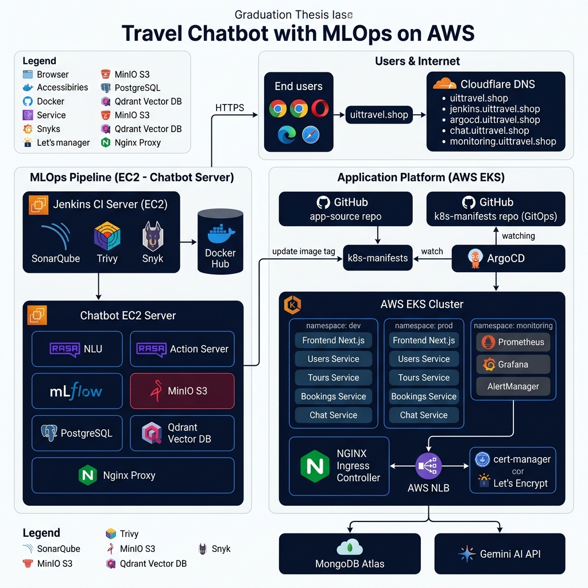
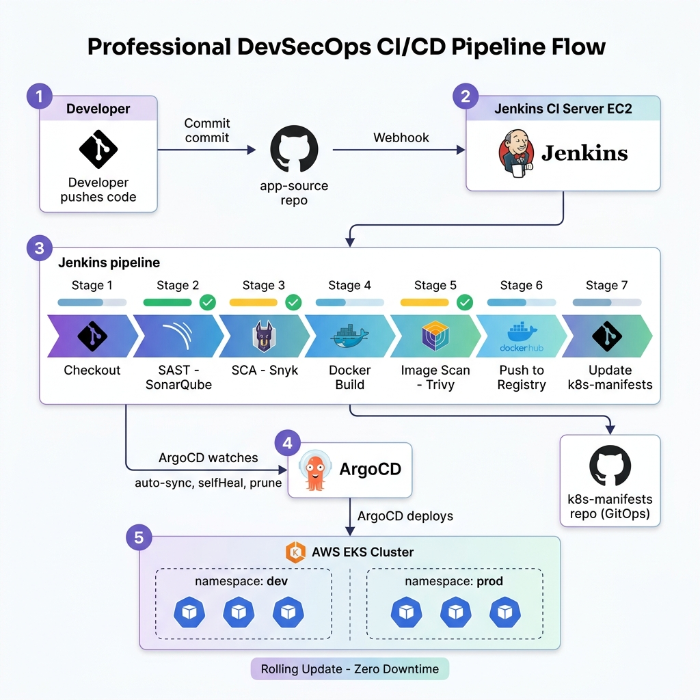
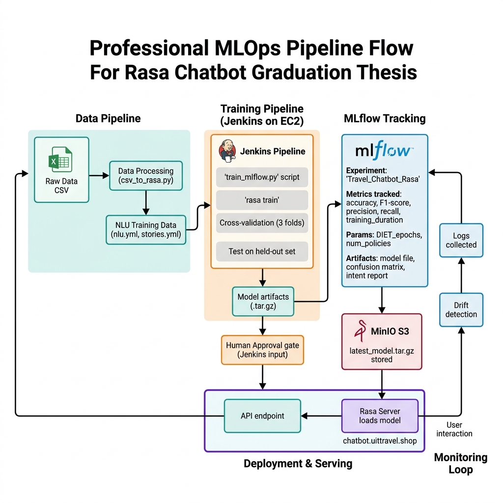
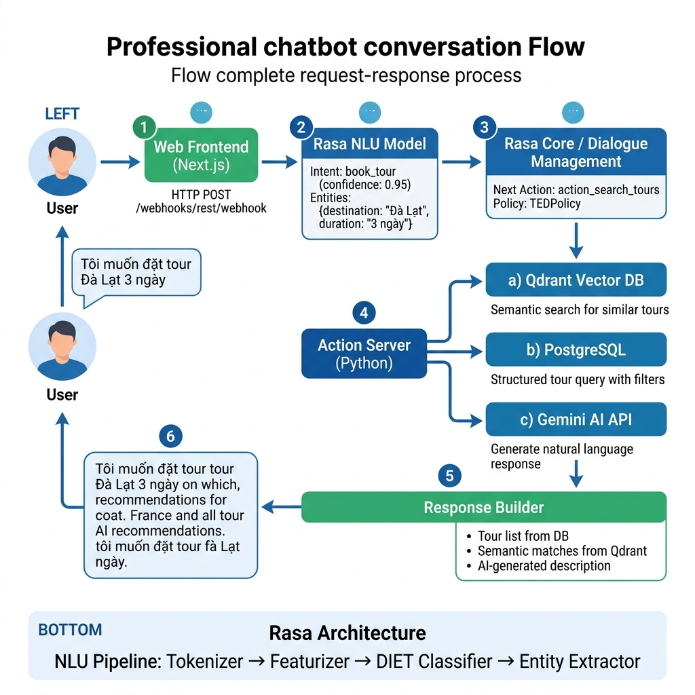
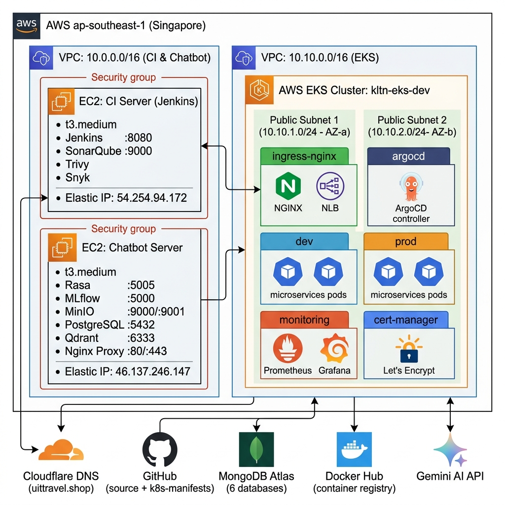
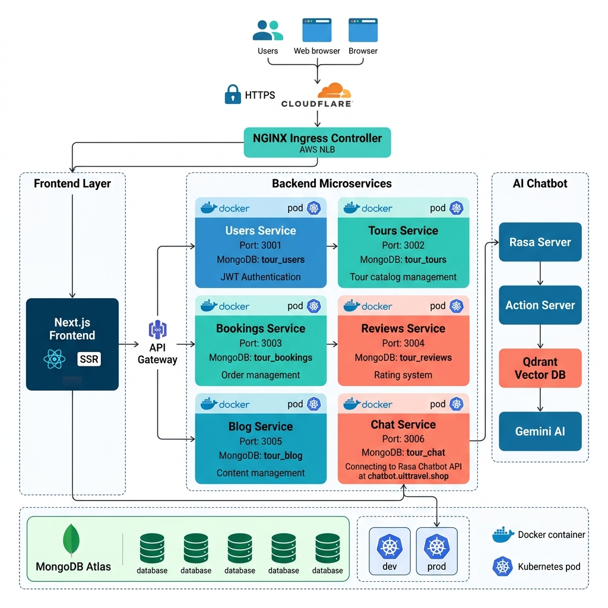

# 📊 Các Hình Kiến Trúc cho Khóa Luận Tốt Nghiệp

> Dùng cho báo cáo KLTN: **"Xây dựng Chatbot Du Lịch với MLOps trên AWS"**

---

## Hình 1: Kiến Trúc Tổng Thể Hệ Thống

**Mô tả:** Sơ đồ tổng quan toàn bộ hệ thống bao gồm các thành phần chính: người dùng truy cập qua domain `uittravel.shop`, Cloudflare DNS phân giải tên miền, Jenkins CI server, Chatbot EC2 server (Rasa, MLflow, MinIO), AWS EKS Cluster với các microservices, và các dịch vụ ngoài (MongoDB Atlas, Gemini AI).

---

## Hình 2: Luồng CI/CD Pipeline (DevSecOps)

**Mô tả:** Luồng CI/CD tự động từ khi developer push code đến khi deploy lên Kubernetes. Pipeline Jenkins gồm 7 stage: Checkout → SAST (SonarQube) → SCA (Snyk) → Docker Build → Image Scan (Trivy) → Push Registry → Update k8s-manifests. ArgoCD tự động sync và deploy lên EKS.

---

## Hình 3: MLOps Pipeline (Train & Deploy AI Model)

**Mô tả:** Vòng đời MLOps hoàn chỉnh của mô hình Rasa: từ xử lý dữ liệu (csv_to_rasa.py) → huấn luyện (Jenkins + train_mlflow.py) → đánh giá cross-validation → theo dõi metrics bằng MLflow → lưu model vào MinIO S3 → cổng phê duyệt (Human Approval) → deploy lên Rasa Server → giám sát data drift.

---

## Hình 4: Luồng Xử Lý Chatbot

**Mô tả:** Luồng xử lý đầy đủ khi người dùng gửi tin nhắn: Frontend → Rasa NLU (nhận dạng intent/entity) → Rasa Core (quản lý hội thoại) → Action Server (Python) gọi song song Qdrant (tìm kiếm ngữ nghĩa), PostgreSQL (truy vấn cấu trúc) và Gemini AI (sinh câu trả lời tự nhiên) → tổng hợp và trả về kết quả.

---

## Hình 5: Kiến Trúc Hạ Tầng AWS

**Mô tả:** Sơ đồ hạ tầng AWS tại khu vực Singapore (ap-southeast-1). Bao gồm 2 VPC: VPC chứa EC2 CI Server (Jenkins, SonarQube) và EC2 Chatbot Server; VPC EKS chứa cluster Kubernetes với 2 node `m7i-flex.large` trải qua 2 AZ. Kết nối với các dịch vụ ngoài: Cloudflare, GitHub, MongoDB Atlas, Docker Hub.

---

## Hình 6: Kiến Trúc Microservices

**Mô tả:** Phân rã kiến trúc microservices của ứng dụng web đặt tour du lịch. 6 service backend (Node.js): Users, Tours, Bookings, Reviews, Blog, Chat — mỗi service có MongoDB database riêng. Chat Service kết nối sang Chatbot Server (Rasa). Tất cả deploy bằng Docker/Kubernetes với 2 môi trường dev và prod.

---

## 📋 Tổng kết các thành phần hệ thống

| Lớp | Công nghệ | Mục đích |
|---|---|---|
| **Frontend** | Next.js (React) | Giao diện người dùng |
| **Backend** | Node.js (Express) | 6 microservices |
| **AI Chatbot** | Rasa Open Source | NLU + Dialog management |
| **Action Server** | Python | Custom actions, DB queries |
| **LLM** | Gemini AI | Sinh câu trả lời tự nhiên |
| **Vector DB** | Qdrant | Semantic search |
| **Relational DB** | PostgreSQL | Dữ liệu tour, địa danh |
| **NoSQL DB** | MongoDB Atlas | Dữ liệu ứng dụng web |
| **Object Storage** | MinIO (S3-compatible) | Lưu model AI |
| **ML Tracking** | MLflow | Theo dõi experiments |
| **Container** | Docker + Kubernetes (EKS) | Triển khai microservices |
| **CI/CD** | Jenkins + ArgoCD | Tự động hóa pipeline |
| **Security Scan** | SonarQube, Snyk, Trivy | SAST, SCA, Image scan |
| **Monitoring** | Prometheus + Grafana | Giám sát hệ thống |
| **DNS & SSL** | Cloudflare + Let's Encrypt | Bảo mật kết nối |
| **IaC** | Terraform | Quản lý hạ tầng as code |
